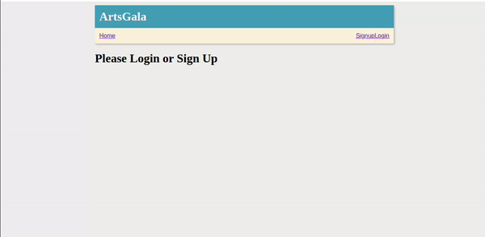

# ArtsEnclave

This is a simple web application that alows a user to signup and login in order to add their favourite art works by various artists.

## Description

- The project uses Rails API backend with a React frontend.

- The application has a landing page prompting the user to login/signup
- After which the user can add their desired artwork by various artists

## Getting Started

### Setup

To set up the frontend and backend dependencies, from the root directory, run:

```console
$ bundle install
$ npm install --prefix client
$  rails db:migrate db:seed
```

To see how the React application and Rails API are interacting, you can run the Rails application in one terminal by running:

```console
$ rails s
```

Then, open another terminal and run React:

```console
$ npm start --prefix client
```

## User Stories

- MVP: As a user, I can:
  SignUp/Log into the site
- View a list of all my available artworks
- Create a new artwork
- Modify or delete artwork

### Models and Relationships

- User
- Artwork

```
Artwork >- User

```



## Technologies

- HTML
- CSS
- JavaScript
- React
- Ruby on Rails

## Help

Depending on the quality of the image and internet speeds, loading times may differ. For questions write an email to owalajoab@gmail.com

## Authors

This project was created by Joab Owala https://github.com/JoabOwala

## Version History

- 0.1
  Initial Release

## License

This project is licensed under the MIT License - see the LICENSE.md file for details

## Acknowledgments

- freefrontend.com/bootstrap-code-examples/
- freefrontend.com/css-cards/

Happy Coding! 💪
